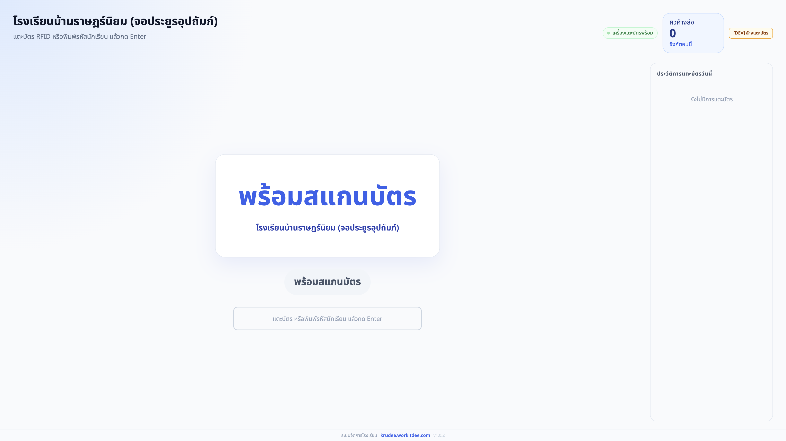
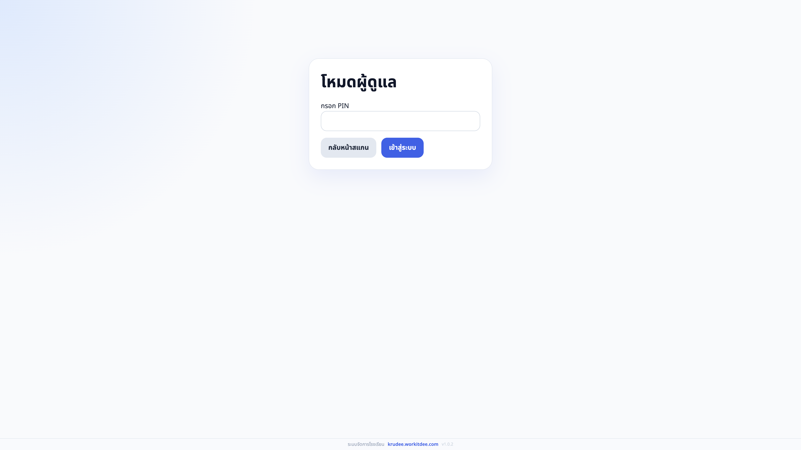
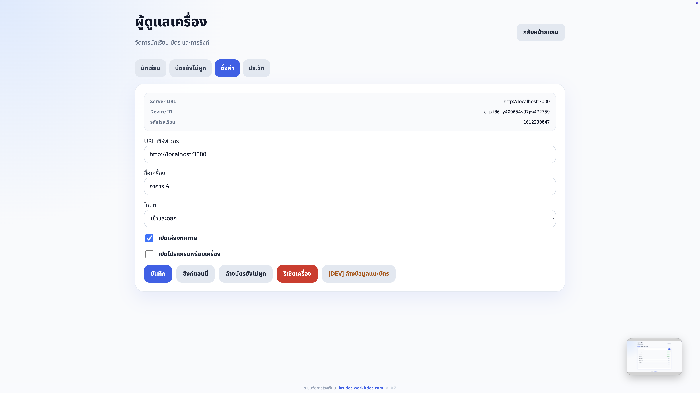

# ครูดี Timestamp

ระบบ kiosk สแกนบัตร RFID สำหรับโรงเรียนในโครงการ ครูดี นักเรียนแตะบัตร RFID (keyboard-wedge) หรือกรอกรหัสนักเรียนเป็น fallback เครื่องจะแสดงข้อมูลนักเรียน พูดทักทายภาษาไทย บันทึกเวลาเข้า-ออกใน SQLite และซิงก์กับ ครูดี server ทุก 5 นาที

---

## Features

- สแกน RFID keyboard-wedge พร้อม cooldown 30 นาทีต่อนักเรียน
- กรอกรหัสนักเรียนเป็น fallback เมื่อลืมบัตร
- ตรวจจับประเภทเข้า/ออก รองรับ `entry`, `exit`, `both`
- เสียงทักทายภาษาไทยผ่าน TTS (espeak / say / PowerShell)
- ฐานข้อมูล SQLite ในเครื่อง — ทำงานได้แม้ไม่มีอินเทอร์เน็ต
- ดึงรายชื่อนักเรียนทุก 30 นาที / ซิงก์ attendance ทุก 5 นาที
- หน้า Admin — PIN-protected, ผูก/ยกเลิกบัตร, ดู changelog, ดูประวัติ
- อัปเดตอัตโนมัติผ่าน `electron-updater`
- เปิดโปรแกรมพร้อมเครื่อง (configurable)

---

## Screenshots

| หน้าสแกนนักเรียน | หน้า Login Admin | หน้าตั้งค่า Admin |
|---|---|---|
|  |  |  |

---

## Development

```bash
npm install       # ติดตั้ง dependencies + electron native modules
npm run dev       # electron-vite dev server
npm run typecheck # vue-tsc --noEmit
npm run build     # build ไปที่ out/
```

Default server URL: `http://localhost:3000`
Production URL: `https://krudee.workitdee.com`

---

## Packaging & Release

```bash
npm run build:win    # Windows (NSIS installer)
npm run build:linux  # Linux (AppImage + deb)
npm run build:mac    # macOS (dmg)
```

### Auto Release (GitHub Actions)

สร้าง Release บน GitHub → Actions จะ build และอัปโหลดไฟล์ติดตั้งทุก platform โดยอัตโนมัติ
ไม่ต้องตั้ง secret เพิ่ม — ใช้ `GITHUB_TOKEN` ที่ GitHub สร้างให้อัตโนมัติ

---

## Architecture

```
src/
├── main/        # Node process — SQLite, IPC handlers, sync, TTS, config
├── preload/     # contextBridge — typed API bridge ระหว่าง main ↔ renderer
└── renderer/    # Vue 3 SPA — Kiosk, Admin, Setup, Offline pages
```

ดูรายละเอียดใน [CLAUDE.md](CLAUDE.md)

---

## Changelog

ดู [CHANGELOG.md](CHANGELOG.md) หรือเปิดหน้า Admin → tab "Changelog" ในแอป

---

## Contributing

โปรเจคนี้เปิดรับนักพัฒนาที่อยากช่วยพัฒนาระบบเช็คชื่อนักเรียนให้โรงเรียนไทย

### แนวทางการมีส่วนร่วม

1. **Fork** repo นี้แล้ว clone ลงเครื่อง
2. สร้าง branch ใหม่จาก `main` เช่น `feature/your-feature`
3. รัน `npm install && npm run dev` เพื่อเริ่ม dev server
4. แก้ไขและรัน `npm run typecheck` ให้ผ่านก่อน commit
5. เปิด Pull Request มาที่ `main` พร้อมอธิบายว่าแก้/เพิ่มอะไร

### สิ่งที่อยากให้ช่วย

- รองรับ RFID reader แบบ Serial/HID (`src/main/rfid/reader.ts` ยังเป็น stub)
- UI ภาษาไทยให้ครบและสวยขึ้น
- ระบบรายงานสรุปการเข้าเรียน
- Offline-first ที่แข็งแกร่งขึ้น — queue sync เมื่อกลับมา online
- Pre-rendered TTS cache (`src/main/tts/cache.ts` ยังเป็น stub)
- Test coverage

### Code Style

- TypeScript เต็มรูปแบบ ไม่มี `any` โดยไม่จำเป็น
- renderer → main ผ่าน IPC เท่านั้น (ดู `src/main/ipc.ts`)
- String ที่แสดงผลต่อผู้ใช้เป็นภาษาไทย

### ติดต่อ

เปิด Issue บน GitHub หรือส่ง email มาที่ [krudee@workitdee.com](mailto:krudee@workitdee.com)
